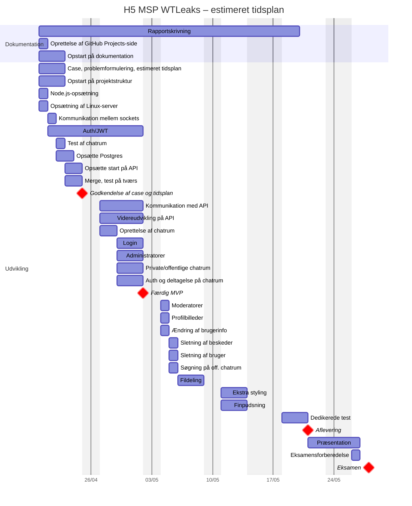

## Case: Real-time chat applikation med rum og filhåndtering WTLeaks

Hjælp! En bruger har igen lækket fortrolig information igennem War Thunder! De har derfor brug for hurtig og effektiv og ikke mindst sikker kommunikation. Værktøjer som Slack, Discord og Teams tilbyder dette, men er ofte enten for komplekse eller lukkede systemer. Det er her, vi kommer ind i billedet: hos WTLeaks har vi en løsning, der fungerer, så det ikke sker igen.

