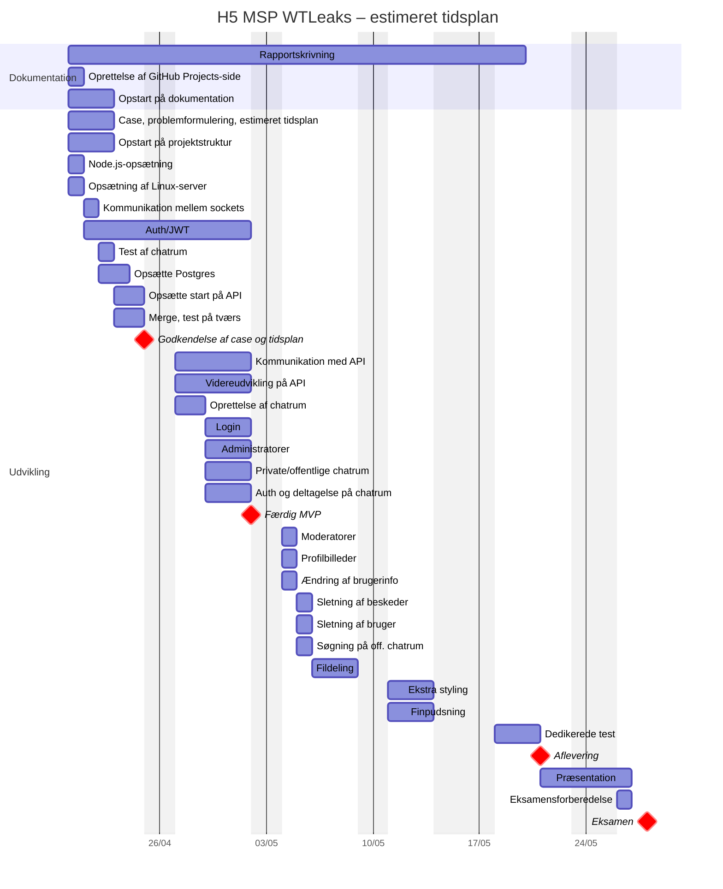

## Case: Real-time chat applikation med rum og filhåndtering WTLeaks

Hjælp! En bruger har igen lækket fortrolig information igennem War Thunder! De har derfor brug for hurtig og effektiv og ikke mindst sikker kommunikation. Værktøjer som Slack, Discord og Teams tilbyder dette, men er ofte enten for komplekse eller lukkede systemer. Det er her, vi kommer ind i billedet: hos WTLeaks har vi en løsning, der fungerer, så det ikke sker igen.
### Projektbeskrivelse
Vi vil udvikle en chat-applikation/platform, hvor brugere kan skrive med hinanden, enten i private eller offentlige rum. Brugere vælger selv, hvilke rum, de vil deltage i, og rummene identificeres med et ID og et navn. Offentlige rum kan brugere finde i en liste eller ved søgning, og private rum kan kun deltages i ved brug af givet id og adgangskode. Der er ikke nogen begrænsning for, hvor mange rum, en bruger kan deltage i. Beskeder er tilknyttet brugeren, der sender dem, og kan fjernes til hver en tid. Alle rum har en ejer og en valgfri mængde moderatorer, som kan fjerne både beskeder og brugere fra det tilknyttede rum. Brugere skal have fri adgang til at ændre bl.a. deres skærmnavn.
#### Formål
For vores brugere er målene med vores skalerbare chat-løsning, at de kan:
- Kommunikere i real-time
- Organisere samtaler i rum
- Dele filer
- Være sikre med deres data

For os er målene med dette projekt at vise vores forståelse og kompetencer indenfor:
- Real-time kommunikation
- Full Stack udvikling (frontend + backend)
- Håndtering af brugere
- Arbejde under tidspres

