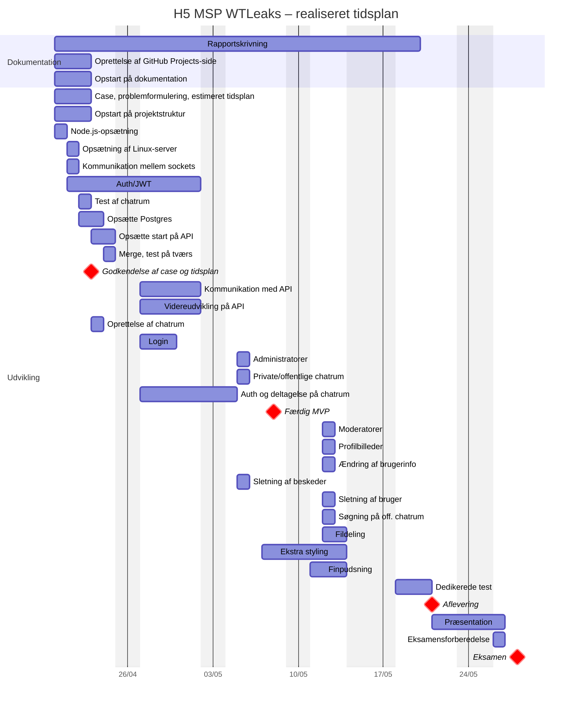

Her er vores aktuelle tidsplan for projektet

```mermaid
---
config:
    themeVariables:
        taskTextColor: 'black'
        taskTextOutsideColor: 'black'
---
gantt
    title H5 MSP WTLeaks – realiseret tidsplan
    dateFormat  YYYY-MM-DD
    axisFormat  %d/%m
    excludes  weekends, 2026-05-14, 2026-05-15, 2026-05-25
    %% todayMarker off
    
    section Dokumentation
    Rapportskrivning  : 2026-04-20, 20d
    Oprettelse af GitHub Projects-side  : 2026-04-20, 3d
    Opstart på dokumentation  : 2026-04-20, 3d
    
    section Udvikling
    %% Uge 1
    Case, problemformulering, estimeret tidsplan  : 2026-04-20, 3d
    Opstart på projektstruktur  : 2026-04-20, 3d
    Node.js-opsætning  : 2026-04-20, 1d
    Opsætning af Linux-server  : 2026-04-21, 1d
    Kommunikation mellem sockets  : 2026-04-21, 1d
    Auth/JWT  : jwt, 2026-04-21, 9d
    Test af chatrum  : 2026-04-22, 1d
    Opsætte Postgres  : 2026-04-22, 2d
    Opsætte start på API  : 2026-04-23, 2d
    Merge, test på tværs  : 2026-04-24, 1d
    Godkendelse af case og tidsplan  : crit, milestone, 2026-04-23, 0d
    
    %% Uge 2
    Kommunikation med API  : 2026-04-27, 5d
    Videreudvikling på API  : 2026-04-27, 5d
    Oprettelse af chatrum  : 2026-04-23, 1d
    Login  : 2026-04-27, 3d
    Administratorer  : 2026-05-05, 1d
    Private/offentlige chatrum  : 2026-05-05, 1d
    Auth og deltagelse på chatrum  : 2026-04-27, 6d
    Færdig MVP  : crit, milestone, 2026-05-08, 0d
    
    %% Uge 3
    Moderatorer  : 2026-05-12, 1d
    Profilbilleder  : 2026-05-12, 1d
    Ændring af brugerinfo  : 2026-05-12, 1d
    Sletning af beskeder  : 2026-05-05, 1d
    Sletning af bruger  : 2026-05-12, 1d
    Søgning på off. chatrum  : 2026-05-12, 1d
    Fildeling  : 2026-05-12, 2d
    
    %% Uge 4
    Ekstra styling  : 2026-05-7, 5d
    Finpudsning  : 2026-05-11, 3d
    
    %% Uge 5
    Dedikerede test  : 2026-05-18, 3d
    Aflevering  : crit, milestone, 2026-05-21, 0d
    Præsentation  : 2026-05-21, 3d
    
    %% Uge 6
    Eksamensforberedelse  : 2026-05-26, 1d
    Eksamen  : crit, milestone, 2026-05-28, 0d
```
